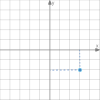
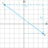
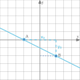
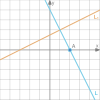

import Desmos from '@components/Desmos.astro';

import Blank from '@components/Blank.astro';

import Option from '@components/Option.astro';

import OptionGrid from '@components/OptionGrid.astro';

import Question from '@components/Question.astro'

import QuestionSet from '@components/QuestionSet.astro'

import MyIcon from '@components/MyIcon.astro'

import Explain from '@components/Explain.astro';

## Point

In Coordinate Geometry, every point is represented by a pair of numbers, called **<u>coordinates</u>**.

<Desmos src="izv3lnlqaa" />

<Question>

#### Find the coordinates of the point.

The coordinates of the point is: $($ <Blank number answer="3" /> $,$ <Blank number answer="-2" />  $)$

</Question>

## Line Segment

Two points form a line segment.

### Midpoint

We can calculate the <u>**midpoint**</u> by the average of the two coordinates:

<Desmos src="magaolmqnm" />

### Distance

We can use the Pythagorean Theorem ($a^2+b^2=c^2$) to calculate the <u>**distance**</u>:

<Desmos src="c1rk1pe1xn" />

<QuestionSet>

<Question>

#### Find the coordinates of the midpoint, then find the length of the line segment.

The coordinates of the point $A$ is: $($ <Blank number answer="-4" /> $,$ <Blank number answer="4" />  $)$

</Question>

<Question>

The coordinates of the point $B$ is: $($ <Blank number answer="4" /> $,$ <Blank number answer="-2" />  $)$

</Question>

<Question>

The x-coordinate of the midpoint $M$ is: $x_M=\frac{x_A + x_B}{2}=$ <Blank number answer="0" />

</Question>

<Question>

The y-coordinate of the midpoint $M$: $y_M=\frac{x_A + x_B}{2}=$ <Blank number answer="1" />

</Question>

<Question>

Thus, the coordinates of the midpoint are: $M(0, 1)$.

The x-coordinates difference is: $x_0=x_B-x_A=$ <Blank number answer="8" />

</Question>

<Question>

The y-coordinate difference is: $y_0=y_B-y_A=$ <Blank number answer="-6" />

</Question>

<Question>

Based on the Pythagorean Theorem ($a^2+b^2=c^2$), the distance of $AB$ is <Blank number answer="10" />

</Question>

</QuestionSet>

## Line

Extend the line segment to infinity, and it forms a line.

### Slope

The <u>**slope**</u> of a line shows its steepness and direction. It shows how quickly the y-coordinates change as the x-coordinates change.

The slope can be calculated from **2 points** on the line.

<Desmos src="vlf2uajkgz" />

### Equation

Given **1 point** and the **slope**, we can determine every point on the line, which forms the equation of the line.

<Desmos src="xcesg9atjn" />

:::tip

When **2 points** are provided, to find the line equation:

- Use 2 points to find the **slope** of the line using the definition.
- Then use **one** of the points and the **slope** to find the equation of the line as above.

:::

<QuestionSet>

<Question>

#### Find the equation of the line passing through $A(-2, 0)$ and $B(2, -2)$.

The x-coordinates difference is: $x_0=x_B-x_A=$ <Blank number answer="4" />

</Question>

<Question>

The y-coordinate difference is: $y_0=y_B-y_A=$ <Blank number answer="-2" />

</Question>

<Question>

The definition of the slope is:

<OptionGrid>

<Option>
$$
\frac{x_0}{y_0}
$$
</Option>

<Option answer>
$$
\frac{y_0}{x_0}
$$
</Option>

<Option>
$$
-\frac{y_0}{x_0}
$$
</Option>

<Option>
$$
-\frac{x_0}{y_0}
$$
</Option>

</OptionGrid>

</Question>

<Question>

Thus, the slope of line is: $m=\frac{y_0}{x_0}=$ <Blank number answer="-0.5" />

</Question>

<Question>

The equation of the line is:
$$
\frac{y-y_A}{x-x_A}=m \Rightarrow \frac{y-0}{x-(-2)}=-0.5
$$
which can be transformed to the general form: $x+$ <Blank number answer="2" /> $y+$ <Blank number answer="2" /> $=0$

</Question>

</QuestionSet>

### Parallel 

When 2 lines are <u>**parallel**</u>, they have the same direction, i.e., the **same slope**. It is written as:
$$
l_1 \parallel l_2
$$
<Desmos src="hugol7l7q7" />

### Perpendicular

When 2 lines are <u>**perpendicular**</u>, they form an angle of $90\degree$.   It is written as:
$$
l_1\perp l_2
$$

<Desmos src="yyx2cudyeo" height="600px" />

So we can know that, for the two perpendicular lines, their slop have the following equation:
$$
m\cdot m_{perp}=-1
$$
<QuestionSet>

<Question>

#### Find the equation of the line $L$ which is perpendicular to line $L_1: x−2y+3=0$ and cuts the $x$-axis at $A(2, 0)$.

To dirrectly find the slope of a line, we need transform it to the form like $y=mx+b$ (slope-intercept form).

The slope-intercept form of line $L_1$ is $y=$ <Blank number answer="0.5" /> $x$ + <Blank number answer="1.5" />

</Question>

<Question>

Thus, the slope of $L_1$ is $m_1=0.5$. Assume the slope of $L$ is $m$.

Since line $L$ is perpendicular to line $L_1$, which of the following is correct?

<OptionGrid>

<Option>
$$
m=m_1
$$
</Option>

<Option>
$$
m=-m_1
$$
</Option>

<Option>
$$
m\cdot m_1 = 1
$$
</Option>

<Option answer>
$$
m\cdot m_1 = -1
$$
</Option>

</OptionGrid>

</Question>

<Question>

So the slope of $L$ is: $m=-\frac{1}{m}=$ <Blank number answer="-2" />

</Question>

<Question>

Line $L$ is passing through $A(2, 0)$,

so the equation of $L$ is:
$$
\frac{y-y_A}{x-x_A}=m \Rightarrow \frac{y-0}{x-2}=-2
$$
which can be transformed to the general form: <Blank number answer="2" />$x+$ <Blank number answer="1" /> $y-4=0$

</Question>

<Question>

Is $L$ parallel tp $L_2: y=-2x$?

<OptionGrid>

<Option answer>

<MyIcon name="check" />

</Option>

<Option>

<MyIcon name="close" />

</Option>

</OptionGrid>

</Question>

</QuestionSet>

## Summary

In this chapter, we leanrt the basic elements in the coordinate geometry, **point**, **line segment**, and **lines**.

|              Point              |                         Line Segment                         |                             Line                             |
| :-----------------------------: | :----------------------------------------------------------: | :----------------------------------------------------------: |
| **Coordinates**:  $(x,~y)$ | **midpoint**:  $M=(\frac{x_1+x_2}{2}, \frac{y_1+y_2}{2})$ |         **Slope**: $m=\frac{y_1-y_2}{x_1-x_2}$          |
|                                 |    **Distance**: $d=\sqrt{(x_1-x_2)^2+(y_1-y_2)^2}$     |          **Equation**: $\frac{y-y_1}{x-x_1}=m$          |
|                                 |                                                              |      **Parallel**: $l_1\parallel l_2 \iff m_1=m_2$      |
|                                 |                                                              | **Perpendicular**: $l_1 \perp l_2 \iff m_1\cdot m_2=-1$ |

## Check your understanding

Please prepare some sketch papers to show your work too!

<QuestionSet quiz>

<Question>

#### Find the coordinates of the midpoint $M$ and the length $d$ of the line segment with point $A(3,6)$ and $B(-3,-2)$.

The coordinates of the midpoint $M$ is: $($ <Blank number answer="0" /> $,$ <Blank number answer="2" />  $)$

The length of the line segment $d$ is: <Blank number answer="10" />

<Explain>

The x-coordinate of midpoint $M$ is $\frac{3 + (-3)}{2}=0$.

The y-coordinate of midpoint $M$ is $\frac{6 + (-2)}{2}=2$.

The x-coordinates difference is: $x_0=(-3)-(3)=-6$.

The y-coordinates difference is: $y_0=(-2)-(6)=-8$.

Based on the Pythagorean Theorem, the distance is: $d=\sqrt{(-6)^2+(-8)^2} =10$.

The answer is: $M(0, 2)$; $d=10$.

</Explain>

</Question>

<Question>

#### Find the equation of the line $L$ which is parallel to line $L_1: y=5x+4$ and cuts the $y$-axis at $A(0, 2)$.

The equation of the line $L$ is: $y=$ <Blank number answer="5" /> $x+$ <Blank number answer="2" />

<Explain>

The slope of $L_1$ is $m_1=5$.

Since $L \parallel L_1$, the slope of the line $m=m_1=5$.

Line $L$ is passing through $A(0, 2)$, so $\frac{y-2}{x-0}=5$.

The answer is: $y=5x+2$.

</Explain>

</Question>

<Question>

#### Find the equation of the line $L$ passing through $A(3, 5)$ and $B(1, -2)$.

The equation of the line $L$ is: <Blank number answer="7" /> $x+$ <Blank number answer="-2" /> $y+$ <Blank number answer="-11" /> $=0$

<Explain>

The x-coordinates difference is: $x_0=1-3=-2$.

The y-coordinates difference is: $y_0=(-2)-(5)=-7$.

Thus, the slope of $L$ is: $m=\frac{y_0}{x_0}=\frac{7}{2}$

Line $L$ is passing through $A(3, 5)$, so $\frac{y-5}{x-3}=\frac{7}{2}$.

The answer is: $7x-2y-11=0$

</Explain>

</Question>

<Question>

#### Find the equation of the line $L$ which passes through the point $A(−6, 1)$ and is perpendicular to the line $L_1: 5x+3y-7=0$.

The equation of the line $L$ is: <Blank number answer="-3" /> $x+$ <Blank number answer="5" /> $y+$ <Blank number answer="-23" /> $=0$

<Explain>

The slope-intercept form of line $L_1$ is $y=-\frac{5}{3}x+\frac{7}{3}$

Thus, the slope of $L_1$ is: $m_1=-\frac{5}{3}$

Since $L \parallel L_1$, we have $m\cdot m_1 = -1$

So the slope of $L$ is $m=-\frac{1}{m_1}=\frac{3}{5}$

Line $L$ is passing through $A(-6, 1)$, so $\frac{y-1}{x-(-6)}=\frac{3}{5}$.

The answer is: $-3x+5y-23=0$

</Explain>

</Question>

</QuestionSet>
